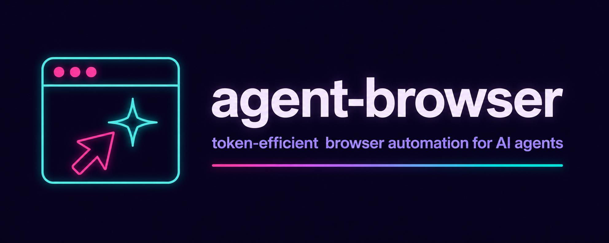
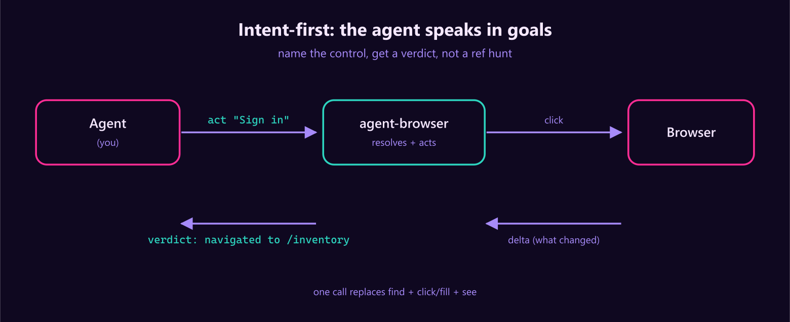
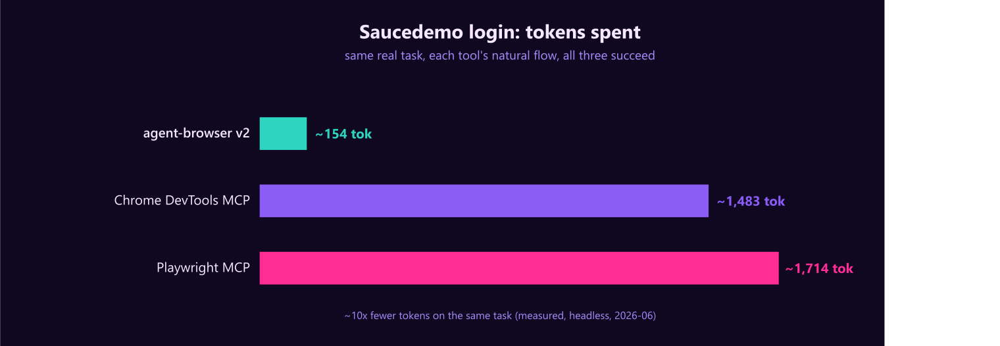
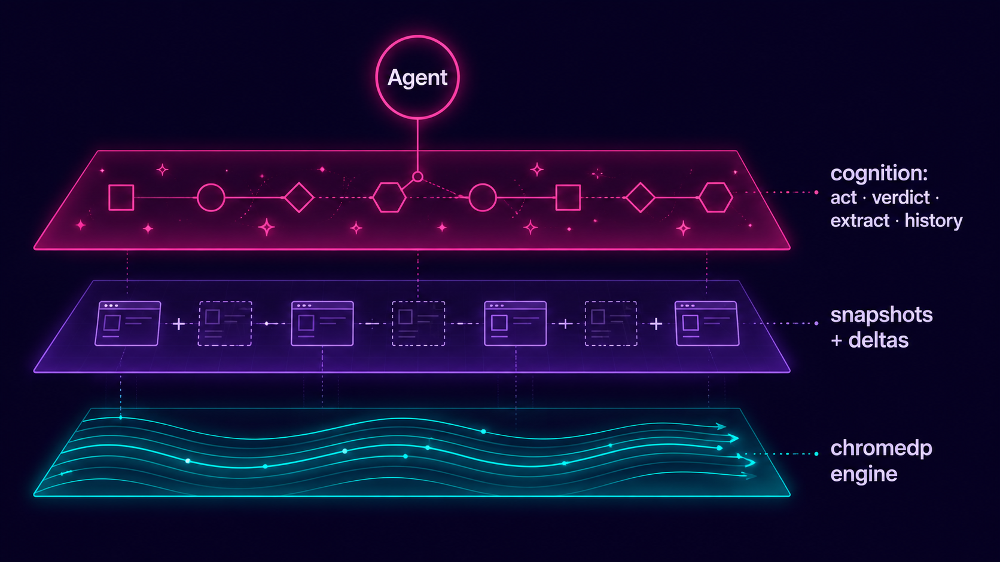

<div align="center">



<br>

**One Go binary** &nbsp;·&nbsp; **Cross-platform** &nbsp;·&nbsp; **Purpose-built engine over chromedp**, no Playwright, no Puppeteer, no Node

<br>

[](LICENSE)
[](https://go.dev)
[](https://github.com/dondai1234/goshawk/actions/workflows/test.yml)
[](https://goreportcard.com/report/github.com/dondai1234/goshawk)
[](https://modelcontextprotocol.io)

<br>



</div>

---

> Built for the **agent that uses it**, not a human. The agent says what it wants (`act "Sign in"`); the tool resolves it, does it, and reports a **verdict**. Snapshots are dense ref-lines, not aria dumps. Every action returns a **delta** (what changed) plus a one-line semantic outcome. Structured data comes back as **JSON**, not 200 refs to reconstruct. The action log is **offloaded** from the agent's context.

## Why

The big browser MCP servers tax the agent every step. goshawk adds a **cognition layer** on top of a token-efficient engine, so the agent spends tokens on the task, not on interpreting the page.

Measured head-to-head against the two largest browser-automation MCP servers:

|  | **goshawk** | Playwright MCP | Chrome DevTools MCP |
|---|:--:|:--:|:--:|
| Snapshot of Hacker News | **~1,200 tok** | ~14,700 tok | ~9,800 tok |
| Snapshot of a GitHub repo | **~1,250 tok** | ~21,600 tok | ~20,800 tok |
| Cost to connect (tool defs + instructions) | **~1,900 tok** (9 tools) | ~3,442 tok (22) | ~5,000 tok (26+) |
| Saucedemo login (real task, all succeed) | **~154 tok** | ~1,714 tok | ~1,483 tok |

<div align="center">

</div>

Within Playwright MCP's ballpark on connect cost (and now lighter: 9 tools, ~1,900 tok to connect), and **for that you also get five things neither has**: intent-first `act`, action `verdict`s, a JS helper API (`js`) for one-call structured data, a one-call universal `login` (single + multi-step, state-verified), and `history`. On a real task the gap is ~10x: the login above is now a single `login` call (or `nav` + three `act` calls) instead of find, fill, fill, find, click, re-see, re-see.

A second, success-normalized benchmark (`bench/successtoken`, 5 multi-step tasks vs `@playwright/mcp`): both 5/5 success, **~1,142 tok vs ~2,337 tok**: ~2x fewer at equal success. Reproduce with `go run ./bench/successtoken -compare`.

<sub>Connect cost estimated as chars/4.41; Playwright MCP from a real Claude Code per-tool breakdown (jdhodges.com); Chrome DevTools MCP commonly reported (varies ~5k–17k by config, low end used). Snapshot + login measured on the live page, headless, 2026-06. Numbers approximate; the per-task row is the decisive comparison.</sub>

## What's new in v4.0 (profiles, batch form filling, confidence verdicts, self-healing refs, login improvements)

A major upgrade focused on real-world reliability. Same 9-tool surface; every new feature folds into an existing tool.

- **Named profiles** (`session mode=profile`): create, switch, list, delete, export, and import isolated browser profiles. Each profile is a separate Chrome user-data-dir with its own cookies, localStorage, auth, and history. Switch in one call. Export/import cookies + localStorage as JSON. [Issue #1](https://github.com/dondai1234/goshawk/issues/1) resolved.
- **Batch form filling** (`act fields={...}`): pass a map of field labels to values and goshawk resolves each label, auto-detects the type (text, checkbox, radio, select, custom combobox, slider, file), and does the right action in one call. Re-snapshots once + reports validation errors. One call instead of N for a whole form.
- **Confidence-scored verdicts**: every act verdict now carries a confidence tag (`[confirmed]` / `[likely]` / `[uncertain]`) based on DOM changes + XHR responses, so the agent knows when to trust the verdict and when to verify.
- **Self-healing refs**: when a ref is stale (page re-rendered), goshawk auto-re-resolves by matching role + name. Conservative: only heals with exactly one match. Saves a `see` round-trip on React re-renders.
- **Login improvements**: `login` now detects and reports "remember me" checkboxes, "forgot password" links, and SSO redirects (URL moved to a different domain after submit).

### Previously in v3.2

Universal login (one-call, single + multi-step), cookie/consent banner auto-dismiss, custom combobox open-select, stealth hardening (Permission API, outer dims, navigator.connection).

### Verification

`go build ./cmd/goshawk`, `go vet ./...`, `gofmt -l` all clean. Unit tests pass; integration tests self-skip without Chrome.

## The cognition layer

<div align="center">

</div>

- **`act`: one tool for any action.** Name a control (`act "Sign in"`, `act "Username" value=x`) OR give a ref/selector; local heuristics resolve it (no LLM, no per-call cost) and do the right thing for its role: click buttons/links, fill inputs (pass `value=`), select dropdowns (pass `value=`), **open-select a custom button+listbox dropdown** (pass `value=`; it opens the popup and clicks the matching option). Add `hover=true` to hover, `key=Enter` to press a key, `files=[..]` to upload. **Batch form fill**: `act fields={"Username":"john","Password":"hunter2","Remember me":"true"}` fills a whole form in one call - auto-detects each field type (text/checkbox/radio/select/slider/file) and does the right action. Optional `waitUrl=/waitText=/waitGone=` fuses a wait. Returns a `[confidence]` verdict + delta; ambiguous matches return ranked candidates (it never guesses).
- **`js`: the structured-data hero.** Run JS with a helper API in scope and get clean JSON back: `return {stars: text('#stars'), lang: attr('.lang','aria-label'), items: $$('li').map(text)}`. Helpers: `$`, `$$` (→array), `text`, `attr`, `html`, `visible`, `data`, `table` (a `<table>` → rows, or objects if the first row is `<th>`), `links` (→`[{text,href}]`), `rect`, `xpath`, `frame(title)` (a same-origin iframe's document), `wait(fn,ms)`. `await="sel"` waits for a selector first. One call, no re-snapshot, no refs to parse, the go-to for any scattered/scraped data. A thrown error is surfaced with the page-side message. Replaces v2's `eval` + `extract` + `collect`.
- **Verdicts on every action.** `navigated to …` / `dialog opened: …` / `status: added to cart` / `changed: +1 -1 ~1` / `page updated` / `no visible effect` / `CHALLENGE: …`. For non-navigation actions it also folds in the XHR/Fetch responses that fired (`net: /api/cart 200`); the "did my click hit the API" loop, closed without a re-see.
- **`nav` returns an orientation.** Navigate and land oriented: page type, auth state, the top primary actions WITH refs, regions, counts, so you can act immediately, no separate `see`. `back`/`forward`/`reload`; `newTab=true` opens a new tab.
- **`see level=outline`: discovery, not guessing.** The page's semantic skeleton (headings/tables/lists/forms/regions) each with a WORKING CSS selector; use it to pick selectors for `js` instead of ping-ponging see/extract/read until one hits. Plus `brief`/`refs`/`text`/`full`/`shot` levels.
- **`login`: universal one-call login.** `login username= password= url=` (url optional) detects the username + password + submit fields, fills them, submits, and reports a state-verified verdict: `logged in` | `2FA/mfa needed` | `CHALLENGE` | `error: <message>` | `still on login page` | `no login form found` (+ SSO buttons listed). Handles single-step (username+password on one page) AND multi-step (Google/Microsoft/banks: username -> Next -> password appears -> submit) under one call. Detects OAuth/SSO buttons and reports them instead of auto-clicking. Verifies the resulting state, not the return status, so a silent failure is reported, not hidden.
- **`history`: session memory offloaded from context.** A rolling log of step / action / verdict / URL. Query it (`last=N`, `errors=true`) to re-orient after a long flow instead of carrying the transcript in your context window.
- **Recovery built in.** `session mode=reset` relaunches the browser (a wedged tab/crashed browser/stale state); `mode=clear` wipes cookies + storage and reloads (a one-call clean slate). Every op is bounded by an op-timeout so a hung page errors instead of wedging.

## Quick start

Requires [Go](https://go.dev) 1.26+ and Chrome/Chromium (auto-discovered).

```sh
go install github.com/dondai1234/goshawk/v3/cmd/goshawk@latest
goshawk --version        # verify; re-run the install command to update
```

Add it to any MCP client:

```json
{
  "mcpServers": {
    "goshawk": { "command": "goshawk", "args": ["mcp"] }
  }
}
```

Cursor, Claude Code, Claude Desktop, Windsurf, VS Code Copilot, opencode, Hermes Agent, and OpenClaw all work with this shape (VS Code uses `"servers"` instead of `"mcpServers"`). Ready-to-paste configs and per-client file paths are in [`examples/`](examples/README.md). Claude Code one-liner: `claude mcp add goshawk -- goshawk mcp`.

> `spawn goshawk ENOENT`? The client can't find the binary on its PATH; use the absolute path in `command`: `$(go env GOPATH)/bin/goshawk` (append `.exe` on Windows).

<details>
<summary><b>Or: paste this prompt and let your agent install it</b></summary>

```
Install the goshawk MCP server and connect it to this client:
1. Run:  go install github.com/dondai1234/goshawk/v3/cmd/goshawk@latest
2. Verify:  goshawk --version   (expect an goshawk v3.x version)
3. Find out which agent harness you're running on (Opencode, OpenClaw, Hermes Agent, etc.) and locate its MCP config.
4. Add a stdio MCP server named "goshawk": command "goshawk", args ["mcp"].
5. Confirm it connects, then tell me it's ready.
```

</details>

## The workflow

```
nav https://saucedemo.com                    →  page: login form | auth: anonymous | actions: r3 button "Login" | r4 textbox "Username"
act "Username" value="standard_user"        →  act "Username" -> [r4] textbox (fill)  | verdict: changed
act "Password" value="secret_sauce"         →  act "Password" -> [r5] textbox (fill)  | verdict: changed
act "Login" waitUrl="/inventory.html"       →  act "Login"    -> [r3] button (click)  | verdict: navigated to /inventory.html
js "return {price: text('.inventory_item_price').slice(1), name: text('.inventory_item_name')}"
                                             →  {"price":"29.99","name":"Sauce Labs Backpack"}
see level=outline                           →  h2 ".title" "Products"  ·  div ".inventory_list" (6 items)
```

Name the control, get a verdict. You rarely call `see` after an action; the verdict + delta tell you what happened. For data, one `js` call with the helper API replaces a find→see→extract→read dance. By-ref mode (`find` then `act ref=r12`) still works when you need precision.

## Tools (9)

**Move & look**: `nav` (open/back/forward/reload/newTab → orientation) · `see` (brief / refs / text / outline / full / shot)

**Act & scrape**: `act` (click/fill/select/hover/press/upload by intent/ref/selector + optional wait → verdict+delta) · `login` (universal one-call login: single + multi-step, state-verified verdict) · `js` (run JS with a helper API → clean JSON) · `find` (by role/text → refs; by selector → matches; `selectors=true` for both)

**Session**: `tabs` (list/switch/close/label) · `history` (action log) · `session` (reset / clear)

Every tool's description is hand-crafted to tell the agent exactly what to pass, what it returns, and the gotcha, masterable from the defs alone. `js` covers anything the typed tools don't.

## Anti-bot / stealth: on by default (`--no-stealth` to disable)

- **Static tells patched**: `navigator.webdriver=false` (via `--disable-blink-features=AutomationControlled`, `--enable-automation` dropped); `userAgentData`/`plugins`/`languages`/`window.chrome`/WebGL/hardware spoofed via a pre-page init script. Verified: `webdriver=false`, `plugins=5`, `languages=en-US,en`.
- **Real fingerprint**: `--headless=new` (near-real) by default; `--headless=false` for the real GPU/canvas/timing fingerprint on hard targets.
- **Behavioral realism**: a jittered smoothstep mouse path before each click; `act key=` for typed input.
- **Proxies + challenge detection**: `--proxy-server` for residential proxies (the biggest IP-reputation lever); `navigate`/`see` surface `CHALLENGE:` on Cloudflare/DataDome/reCAPTCHA/hCaptcha/Turnstile and auto-wait for managed challenges to clear. A click that lands on a challenge reports `verdict: CHALLENGE: …`.

<details>
<summary><b>Honest limits: no chromedp tool beats these</b></summary>

- The **CDP runtime signal** (a debugger-attached timing delta) is fundamental to CDP; only a custom Chromium build (e.g. Camoufox) hides it.
- **Image-CAPTCHA solving** (reCAPTCHA grids, hCaptcha) needs a paid solver; solver integration (user-provided API key) is planned.
- The intent resolver + verdict heuristics are best-effort over the a11y tree, not ground truth. `act` falls back to candidates when ambiguous (never guesses); `js` + `see level=outline` give the raw structure; `see level=refs` is always there for the raw refs.
- For hard targets, stack: `--headless=false` + `--proxy-server <residential>` + a solver.
- Cross-origin iframes are opaque (as for any tool); same-origin iframes work fully.

</details>

## Flags

`--headless` · `--user-data-dir` · `--no-persist` (throwaway profile; by default logins persist at `<os config dir>/goshawk`, with an automatic fallback to a throwaway profile if it's locked by a leftover Chrome) · `--proxy-server` · `--user-agent` · `--viewport W,H` · `--no-stealth` · `--no-cookie-dismiss` (cookie/consent banner auto-dismiss on nav; on by default) · `--no-eval` (`js` on by default; disable to forbid arbitrary page JS) · `--op-timeout` (per-CDP-op, default 30s) · `--idle-timeout` (auto-close Chrome after this long idle, default 10m; 0 disables) · `--allow-insecure-schemes` · `--version`

---

<div align="center">

**MIT** · [Changelog](CHANGELOG.md) · [Example MCP configs](examples/README.md) · [Benchmarks](bench/)

Built for the agent that uses it.

</div>
