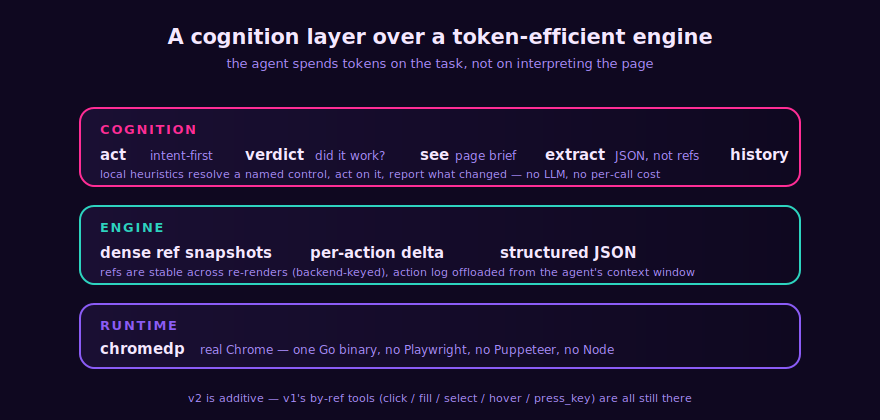

<div align="center">


<br>

**One Go binary** &nbsp;·&nbsp; **Cross-platform** &nbsp;·&nbsp; **Purpose-built engine over chromedp** — no Playwright, no Puppeteer, no Node

<br>

[](LICENSE)
[](https://go.dev)
[](https://github.com/dondai1234/agent-browser/actions/workflows/test.yml)
[](https://goreportcard.com/report/github.com/dondai1234/agent-browser)
[](https://modelcontextprotocol.io)

<br>


</div>

---

> Built for the **agent that uses it**, not a human. The agent says what it wants (`act "Sign in"`); the tool resolves it, does it, and reports a **verdict**. Snapshots are dense ref-lines, not aria dumps. Every action returns a **delta** (what changed) plus a one-line semantic outcome. Structured data comes back as **JSON**, not 200 refs to reconstruct. The action log is **offloaded** from the agent's context.

## Why

The big browser MCP servers tax the agent every step. agent-browser adds a **cognition layer** on top of a token-efficient engine, so the agent spends tokens on the task, not on interpreting the page.

Measured head-to-head against the two largest browser-automation MCP servers:

|  | **agent-browser** | Playwright MCP | Chrome DevTools MCP |
|---|:--:|:--:|:--:|
| Snapshot of Hacker News | **~1,200 tok** | ~14,700 tok | ~9,800 tok |
| Snapshot of a GitHub repo | **~1,250 tok** | ~21,600 tok | ~20,800 tok |
| Cost to connect (tool defs + instructions) | **~3,750 tok** (22 tools) | ~3,442 tok (22) | ~5,000 tok (26+) |
| Saucedemo login (real task, all succeed) | **~154 tok** | ~1,714 tok | ~1,483 tok |

<div align="center">

</div>

Within Playwright MCP's ballpark on connect cost, lighter than Chrome DevTools MCP, and **for that you also get three things neither has**: intent-first `act`, action `verdict`s, and `extract`/`history`. On a real task the gap is ~10x: the login above is `navigate` + three `act` calls (name the field, name the button) instead of find, fill, fill, find, click, re-see, re-see.

A second, success-normalized benchmark (`bench/successtoken`, 5 multi-step tasks vs `@playwright/mcp`): both 5/5 success, **~1,142 tok vs ~2,337 tok** — ~2x fewer at equal success. Reproduce with `go run ./bench/successtoken -compare`.

<sub>Connect cost estimated as chars/4.41; Playwright MCP from a real Claude Code per-tool breakdown (jdhodges.com); Chrome DevTools MCP commonly reported (varies ~5k–17k by config, low end used). Snapshot + login measured on the live page, headless, 2026-06. Numbers approximate; the per-task row is the decisive comparison.</sub>

## The cognition layer

<div align="center">

</div>

- **`act` — intent-first actions.** Pass a control's name (`act "Sign in"`, `act "Username" value=x`); local heuristics resolve it (no LLM, no per-call cost), perform the right action for its role (click / fill / select), and return a verdict + delta. Collapses find + click/fill + see into one call. Ambiguous matches return ranked candidates — it never guesses; disambiguate with `nth` or `role`, or use `click`/`fill` by ref.
- **Verdicts on every action.** `navigated to …` / `dialog opened: …` / `status: added to cart` / `changed: +1 -1 ~1` / `no visible effect` / `CHALLENGE: …`. For non-navigation actions it also folds in the XHR/Fetch responses that fired (`net: /api/cart 200`) — the "did my click hit the API" loop, closed without a re-see.
- **`see level=brief` — page comprehension.** A ~50-token page brief: page type (login form / list / article / dialog), auth state (logged in / anonymous / blocked), the top primary actions with refs, regions, counts. Land oriented without scanning refs.
- **`extract` — structured data, not ref-parsing.** `extract table` (rows, JSON; objects if the first row is headers), `extract links` (`[{text,href}]`), `extract list`, `extract form` (`[{ref,role,name,value}]` — feed it back to `act`/`fill`), `extract article` (main content text), `extract text` (each matched element's text, requires `selector`). Pass `selector=` to scope any kind to a region (just the infobox, just the releases list) and `maxChars=` to cap the length — the #1 token-saving lever.
- **`collect` — named values in one call, no JS.** Pass `fields={label:selector}` (e.g. `{stars: ".stars", price: "#price", title: "h1"}`), get back `{label:value}` JSON. `attrs={label:attrName}` pulls an attribute (a link's href). One call for several specific values — a repo's stars + language + issues, or an article's title + first paragraph + infobox — replacing N `extract` calls or a custom `eval`.
- **`history` — session memory offloaded from context.** A rolling log of step / action / verdict / URL. Query it (`last=N`, `errors=true`) to re-orient after a long flow instead of carrying the transcript in your context window.
- **Semantic `wait` + multi-field `fill` + browser QoL.** `wait url=/text=/gone=` for conditions, not blind timeouts. `fill fields={ref:value}` for a whole form in one call. `navigate action=back|forward|reload`, `scroll ref=r12`, `read` on a link ref returns its `href`, `screenshot fullPage=true|ref=r12`, and `where` for a 30-token re-orientation when you lose your place.

## Quick start

Requires [Go](https://go.dev) 1.26+ and Chrome/Chromium (auto-discovered).

```sh
go install github.com/dondai1234/agent-browser/v2/cmd/agent-browser@latest
agent-browser --version        # verify; re-run the install command to update
```

Add it to any MCP client:

```json
{
  "mcpServers": {
    "agent-browser": { "command": "agent-browser", "args": ["mcp"] }
  }
}
```

Cursor, Claude Code, Claude Desktop, Windsurf, VS Code Copilot, opencode, Hermes Agent, and OpenClaw all work with this shape (VS Code uses `"servers"` instead of `"mcpServers"`). Ready-to-paste configs and per-client file paths are in [`examples/`](examples/README.md). Claude Code one-liner: `claude mcp add agent-browser -- agent-browser mcp`.

> `spawn agent-browser ENOENT`? The client can't find the binary on its PATH — use the absolute path in `command`: `$(go env GOPATH)/bin/agent-browser` (append `.exe` on Windows).

<details>
<summary><b>Or: paste this prompt and let your agent install it</b></summary>

```
Install the agent-browser MCP server and connect it to this client:
1. Run:  go install github.com/dondai1234/agent-browser/v2/cmd/agent-browser@latest
2. Verify:  agent-browser --version   (expect an agent-browser v2.x version)
3. Find out which agent harness you're running on (Opencode, OpenClaw, Hermes Agent, etc.) and locate its MCP config.
4. Add a stdio MCP server named "agent-browser": command "agent-browser", args ["mcp"].
5. Confirm it connects, then tell me it's ready.
```

</details>

## The workflow

```
navigate https://saucedemo.com level=brief   →  page: login form | auth: anonymous | actions: r3 button "Login"
act "Username" value="standard_user"         →  act "Username" -> [r4] textbox (fill)  | verdict: changed
act "Password" value="secret_sauce"          →  act "Password" -> [r5] textbox (fill)  | verdict: changed
act "Login"                                  →  act "Login"    -> [r3] button (click)  | verdict: navigated to /inventory.html
extract form                                 →  [{"ref":"r4","role":"textbox","name":"Username"}, ...]
where                                        →  url / page / auth / last action / scroll position
```

Name the control, get a verdict. You rarely call `see` after an action — the verdict + delta tell you what happened. By-ref mode (`find` then `click r12`) still works when you need precision.

## Tools (22)

**Orientation** — `see` (brief/minimal/summary/full) · `where` (30-token re-orientation) · `read` (link refs include `href`)

**Intent-first actions** — `act` (resolve by name, no LLM) · `fill` (single or `{ref:value}` map) · `click` · `select` (by ref or CSS selector; value or visible text) · `hover` (fires CSS `:hover`) · `press_key` (native key events; Enter submits) · `scroll` (pixels or `ref`; reports position)

**Find & extract** — `find` (incl. `selector=` CSS escape hatch) · `extract` (table / links / list / form / article → JSON) · `collect` (named `{label:selector}` → `{label:value}` JSON in one call, no JS)

**Navigation** — `navigate` (open / back / forward / reload) · `tabs` · `upload`

**Observe** — `wait` (url/text/gone conditions) · `screenshot` (viewport / fullPage / ref) · `eval` (canvas, computed state, cookies, console errors)

**Session** — `history` (rolling log, queryable) · `clear` (one-call clean slate: wipe cookies + storage and reload) · `reset` (relaunch the browser — recover from a wedged tab or a crashed browser)

Every tool's description is hand-crafted to tell the agent exactly what to pass, what it returns, and the gotcha. `eval` covers anything the typed tools can't expose.

## Anti-bot / stealth — on by default (`--no-stealth` to disable)

- **Static tells patched**: `navigator.webdriver=false` (via `--disable-blink-features=AutomationControlled`, `--enable-automation` dropped); `userAgentData`/`plugins`/`languages`/`window.chrome`/WebGL/hardware spoofed via a pre-page init script. Verified: `webdriver=false`, `plugins=5`, `languages=en-US,en`.
- **Real fingerprint**: `--headless=new` (near-real) by default; `--headless=false` for the real GPU/canvas/timing fingerprint on hard targets.
- **Behavioral realism**: a jittered smoothstep mouse path before each click; `press_key` for typed input.
- **Proxies + challenge detection**: `--proxy-server` for residential proxies (the biggest IP-reputation lever); `navigate`/`see` surface `CHALLENGE:` on Cloudflare/DataDome/reCAPTCHA/hCaptcha/Turnstile and auto-wait for managed challenges to clear. A click that lands on a challenge reports `verdict: CHALLENGE: …`.

<details>
<summary><b>Honest limits — no chromedp tool beats these</b></summary>

- The **CDP runtime signal** (a debugger-attached timing delta) is fundamental to CDP; only a custom Chromium build (e.g. Camoufox) hides it.
- **Image-CAPTCHA solving** (reCAPTCHA grids, hCaptcha) needs a paid solver — solver integration (user-provided API key) is planned.
- The intent resolver + verdict + extract heuristics are best-effort over the a11y tree, not ground truth. `act` falls back to candidates when ambiguous (never guesses); `extract` says "no X found" when the page has none; `see level=summary` is always there for the raw refs.
- For hard targets, stack: `--headless=false` + `--proxy-server <residential>` + a solver.
- Cross-origin iframes are opaque (as for any tool); same-origin iframes work fully.

</details>

## Flags

`--headless` · `--user-data-dir` · `--no-persist` (throwaway profile; by default logins persist at `<os config dir>/agent-browser`, with an automatic fallback to a throwaway profile if it's locked by a leftover Chrome) · `--proxy-server` · `--user-agent` · `--viewport W,H` · `--no-stealth` · `--no-eval` (eval on by default) · `--op-timeout` (per-CDP-op, default 30s) · `--idle-timeout` (auto-close Chrome after this long idle, default 10m; 0 disables) · `--allow-insecure-schemes` · `--version`

---

<div align="center">

**MIT** · [Changelog](CHANGELOG.md) · [Example MCP configs](examples/README.md) · [Benchmarks](bench/)

Built for the agent that uses it.

</div>
