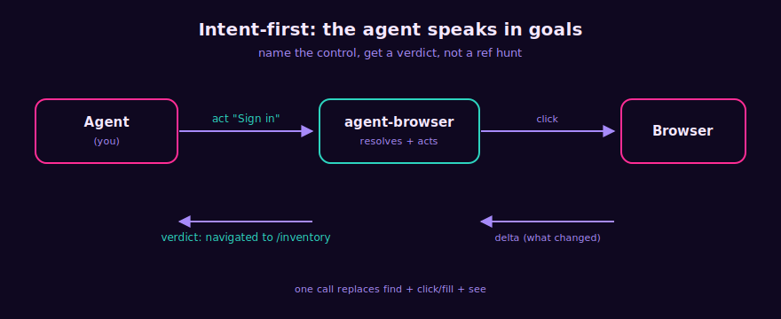
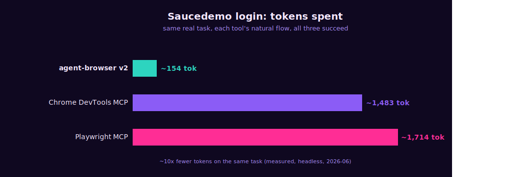

<div align="center">


<br>

One Go binary &nbsp;·&nbsp; Cross-platform &nbsp;·&nbsp; Purpose-built engine over chromedp (no Playwright, no Puppeteer, no Node)

<br><br>

[](LICENSE)
[](https://go.dev)
[](https://github.com/dondai1234/agent-browser/actions/workflows/test.yml)
[](https://goreportcard.com/report/github.com/dondai1234/agent-browser)
[](https://modelcontextprotocol.io)

<br>


</div>

---

> Built for the **agent that uses it**, not a human. The agent says what it wants (`act "Sign in"`); the tool resolves it, does it, and reports a **verdict**. Snapshots are dense ref-lines, not aria dumps. Every action returns a **delta** (what changed) plus a one-line semantic outcome. Structured data comes back as **JSON**, not 200 refs to reconstruct. The action log is **offloaded** from the agent's context.

## Why

The big browser MCP servers tax the agent every step. agent-browser v2 adds a **cognition layer** (intent-first actions, verdicts, structured extraction, session memory) on top of the v1 token-efficient engine, so the agent spends tokens on the task, not on interpreting the page.

Measured head-to-head against the two largest browser-automation MCP servers:

|  | **agent-browser v2** | Playwright MCP | Chrome DevTools MCP |
|---|:--:|:--:|:--:|
| Snapshot of Hacker News | **~1,200 tok** | ~14,700 tok | ~9,800 tok |
| Snapshot of a GitHub repo | **~1,250 tok** | ~21,600 tok | ~20,800 tok |
| Cost to connect (tool defs + instructions) | **~3,650 tok** (20 tools) | ~3,442 tok (22) | ~5,000 tok (26+) |
| Saucedemo login (real task, all succeed) | **~154 tok** (intent-first) | ~1,714 tok | ~1,483 tok |

<div align="center">

</div>

Within Playwright MCP's ballpark on connect cost, lighter than Chrome DevTools MCP, and **for that you also get three things neither has**: intent-first `act`, action `verdict`s, and `extract`/`history`. On a real task the gap is ~10x: the login above is `navigate` + three `act` calls (name the field, name the button) instead of find, fill, fill, find, click, re-see, re-see.

<sub>Connect cost: agent-browser v2 ~3,650 tok estimated as chars/4.41 (20 tools, including the `reset` recovery tool); Playwright MCP ~3,442 tok from a real Claude Code per-tool breakdown (jdhodges.com); Chrome DevTools MCP ~5,000 tok commonly reported (figures vary ~5k-17k by config/version, using the low end). Snapshot sizes + the login task measured by running each server on the live page (Windows, headless, 2026-06); the login is ours via intent-first `act` (navigate brief + 3 acts) vs the competitors' by-ref flow, all three succeeding. Numbers are approximate; the per-task row is the decisive comparison.</sub>

## What's new in v2 (the cognition layer)

<div align="center">

</div>

- **`act` - intent-first actions.** Pass a control's name (`act "Sign in"`, `act "Username" value=x`); local heuristics resolve it (no LLM, no per-call cost), perform the right action for its role (click / fill / select), and return a verdict + delta. Collapses find + click/fill + see into one call. Ambiguous matches return ranked candidates (it never guesses) - disambiguate with `nth` or `role`, or use `click`/`fill` by ref.
- **Verdicts on every action.** `navigated to ...` / `dialog opened: ...` / `status: added to cart` / `changed: +1 -1 ~1` / `no visible effect` / `CHALLENGE: ...`. For non-navigation actions it also folds in the XHR/Fetch responses that fired (`net: /api/cart 200`) - the "did my click hit the API" loop, closed without a re-see.
- **`see level=brief` - page comprehension.** A ~50-token page brief: page type (login form / list / article / dialog), auth state (logged in / anonymous / blocked), the top primary actions with refs, regions, counts. Land oriented without scanning refs.
- **`extract` - structured data, not ref-parsing.** `extract table` (rows, JSON; objects if the first row is headers), `extract links` (`[{text,href}]`), `extract list`, `extract form` (`[{ref,role,name,value}]` from the cached tree - feed it back to `act`/`fill`), `extract article` (main content text).
- **`history` - session memory offloaded from context.** A rolling log of step / action / verdict / URL. Query it (`last=N`, `errors=true`) to re-orient after a long flow instead of carrying the transcript in your context window.
- **Semantic `wait` + multi-field `fill` + browser QoL.** `wait url=/text=/gone=` for conditions, not blind timeouts. `fill fields={ref:value}` for a whole form in one call. `navigate action=back|forward|reload`, `scroll ref=r12` (scroll an element into view), `read` on a link ref returns its `href`, `screenshot fullPage=true|ref=r12`, and `where` for a 30-token re-orientation when you lose your place.

v1's by-ref tools (`click`/`fill`/`select`/`hover`/`press_key`) are all still there when you have a ref or need a non-default action. v2 is additive.

## What's new in v2.2 (reliability + optimization, from the charlotte head-to-head)

A live head-to-head vs [charlotte](https://github.com/TickTockBent/charlotte) (the closest direct competitor - same token-efficient, AX-tree-first thesis) surfaced three concrete improvements. v2.2 ships all three:

- **Sharper verdict on URL-stable reorders.** A click that reorders the *same* DOM nodes (a product sort, a filter, an SPA re-render) used to read "no visible effect" because the backend-id set was unchanged. v2.2 adds an order-sensitive content signature to each tree; a reorder now reports **"page updated (URL stable; e.g. sort/filter/SPA re-render) - call see to refresh refs"**. Element-level changes still win when present.
- **`nth` from the end.** `act`/`find` disambiguation now accepts negatives: `nth=-1` = last of N identical buttons, `-2` = second-last. The "add the priciest of N identical Add-to-cart buttons" case needs no counting.
- **CSS-selector escape hatch.** `find`/`click`/`fill`/`act` now take `selector="<css>"` to reach elements the a11y tree drops (custom `div[role=widget]`, presentational spans with handlers) - the one place a pure a11y-tree tool loses to a CSS-selector tool. `find selector` returns `[css]` lines with a `sel=` you pass back; the action path reuses the real-mouse click + native-value-setter fill, so reliability matches the ref path.

### v2.2.1: lazy browser launch (no Chrome on startup)

The MCP server used to launch Chrome the moment it started - a Chrome process spawned as soon as your agent client connected, before any tool was called. v2.2.1 makes the launch **lazy**: Chrome spawns on the first **navigate** (or new tab / back-forward-reload), not on server boot. Read-only ops before the first navigate report "no page snapshot yet; call navigate first" and do NOT spawn Chrome. So connecting the server costs zero browser processes until you actually drive it. `Close()` is a no-op if the browser was never launched (no orphan Chrome).

### v2.2.2: idle auto-close (Chrome tears down when not in use)

v2.2.1 stopped Chrome spawning on startup, but once you navigated once, Chrome stayed alive for the whole session. v2.2.2 adds an **idle auto-close**: after `--idle-timeout` (default **10m**) of no browser activity, Chrome is torn down - so a one-shot use doesn't leave it running for the rest of the chat. The next navigate re-launches it seamlessly (page state is lost - re-navigate). `--idle-timeout 0` disables it. Combined with the lazy launch: **zero Chrome processes while idle, spawn on use, tear down when you stop.**

The live comparison (corrected): agent-browser wins on round-trips (33-50% fewer calls), response weight (5-80x smaller), verdicts, and click reliability. charlotte's click on saucedemo's React "Add to cart" returns success with **no effect** (verified: empty cart after a fresh `/cart.html` navigation) - a silent failure. charlotte's real exclusive edges: structural `diff`, session/cookie management, drag-and-drop. Full report: `charlotte-vs-agent-browser-report.md`. Full live suite green (858s, 0 failures); `govulncheck` 0 reachable.

## What's new in v2.1 (stable refs + the honest benchmark)

- **Stable refs.** Refs used to be positional (`r1..rN` in tree order), reassigned on every snapshot, so a page re-render that shifted order silently retargeted an old ref to a *different* control - the agent clicks the wrong element and never knows. Now the same DOM node keeps the same ref across re-renders (a per-tab `backendNodeID -> ref` map with a monotonic counter), so a ref you hold stays valid after the page mutates. The map clears on navigation (fresh page = fresh refs) but the counter stays monotonic, so a stale ref from an earlier page can't collide with a current one - you get a clean `ref not found; call see` instead of a silent wrong-click. Proven live (`TestStableRefsAcrossReRender`, negative-verified).
- **Task-success-per-token benchmark.** Snapshot size is the easy number; success per token is the honest one. `bench/successtoken` runs 5 multi-step tasks (login, search+extract, form fill+select+submit, multi-page nav, lazy-list scroll) head-to-head against `@playwright/mcp` on local fixtures, with a deterministic scripted agent so the comparison is fair + reproducible. Result (2026-06-23): both 5/5 (100%) success, **agent-browser 1142 tokens vs playwright-mcp 2337 tokens** (~2x fewer at equal success). See `bench/successtoken/README.md`.

|  | **agent-browser v2.1** | Playwright MCP |
|---|:--:|:--:|
| Task success (5 multi-step tasks) | **5/5 (100%)** | 5/5 (100%) |
| Total tool-I/O tokens for all 5 tasks | **~1,142 tok** | ~2,337 tok |
| Tokens per success | **~228 tok** | ~467 tok |

<sub>Tool-I/O tokens = (sent args JSON + returned text) / 4, summed over a deterministic scripted agent. Same fixtures, same end-state assertions. Each tool uses its own efficient path (agent-browser `act`+`read`; playwright-mcp `snapshot`+`type`+`click`). Run `go run ./bench/successtoken/ -compare` to reproduce.</sub>

### v2.1.1: ugly-ARIA whitelist hardening

A reviewer noted the role whitelist is only as clean as the page's ARIA: on a messy SPA, decorative `div[role=button]` ads and `span[role=button]` with no handler move UP into the semantic tree, where a static whitelist can't tell them from real controls. v2.1.1 drops interactive elements that are **unnamed AND not focusable** - a native `<button>`/`<a>`/`<input>` is always focusable, so real icon-only buttons and unlabeled inputs stay; a named custom widget stays even if unfocusable; only a nameless, unfocusable "button" (decorative div / ad slot) is dropped. Honest limit: named junk (10x "Click here") stays, because judging name quality is the agent's job. `bench/aria_mess` runs the snapshot against 11 ugly-ARIA pathologies and reports what the whitelist keeps; measured before->after, `decorative-role-button` 8->3 refs, `ad-slot-divs` 9->1, `messy-spa` 36->30, with real icon-only buttons + unlabeled inputs preserved. Full live suite green (no real control dropped on Saucedemo/HN/Wikipedia).

## Install

Requires [Go](https://go.dev) 1.26+ and Chrome/Chromium (auto-discovered).

```sh
go install github.com/dondai1234/agent-browser/v2/cmd/agent-browser@latest
```

Verify the install, and update later with the same command:

```sh
agent-browser --version                                  # check the installed version
go install github.com/dondai1234/agent-browser/v2/cmd/agent-browser@latest    # re-run to update
```

### Or: tell your agent to install it

Copy this prompt into Claude Code, Cursor, Copilot Chat, Windsurf, or any agent with shell + MCP-config access, and it does the rest:

```
Install the agent-browser MCP server and connect it to this client:
1. Run:  go install github.com/dondai1234/agent-browser/v2/cmd/agent-browser@latest
2. Verify:  agent-browser --version   (expect "agent-browser v2.0.0" or newer)
3. Find out which agent harness you're running on (Opencode, OpenClaw, Hermes Agent, etc.) and locate its MCP config.
4. Add a stdio MCP server named "agent-browser": command "agent-browser", args ["mcp"].
5. Confirm it connects, then tell me it's ready.
```

## Connect to your agent

Add it to any MCP client:

```json
{
  "mcpServers": {
    "agent-browser": { "command": "agent-browser", "args": ["mcp"] }
  }
}
```

Cursor, Claude Code, Claude Desktop, Windsurf, VS Code Copilot, opencode, Hermes Agent, and OpenClaw all work with this shape (VS Code uses `"servers"` instead of `"mcpServers"`). Ready-to-paste configs and per-client file paths are in [`examples/`](examples/README.md). Claude Code one-liner: `claude mcp add agent-browser -- agent-browser mcp`.

> If your client reports `spawn agent-browser ENOENT`, it can't find the binary on its PATH - use the absolute path in `command`: `$(go env GOPATH)/bin/agent-browser` (append `.exe` on Windows).

## The agent workflow (v2: intent-first)

```
navigate https://saucedemo.com level=brief   →  page: login form | auth: anonymous | actions: r3 button "Login"
act "Username" value="standard_user"         →  act "Username" -> [r4] textbox (fill)  | verdict: changed
act "Password" value="secret_sauce"          →  act "Password" -> [r5] textbox (fill)  | verdict: changed
act "Login"                                  →  act "Login"    -> [r3] button (click)  | verdict: navigated to /inventory.html
extract form                                 →  [{"ref":"r4","role":"textbox","name":"Username"}, ...]
where                                        →  url / page / auth / last action / scroll position
```

Name the control, get a verdict. You rarely call `see` after an action - the verdict + delta tell you what happened. By-ref mode (`find` then `click r12`) still works when you need precision.

## Tools (20)

`navigate` (open/back/forward/reload) · `see` (brief/minimal/summary/full) · `find` · `extract` (table/links/list/form/article) · `read` (link refs include `href`) · `click` · `act` (intent-first) · `fill` (single or `{ref:value}` map) · `select` · `scroll` (by pixels or `ref`; reports position) · `wait` (url/text/gone conditions) · `screenshot` (viewport/fullPage/ref) · `eval` · `tabs` · `upload` · `press_key` · `hover` · `history` · `where` · `reset` (relaunch the browser - recover from a wedged tab or a crashed browser)

Every tool's description is hand-crafted to tell the agent exactly what to pass, what it returns, and the gotcha. `act` resolves by name with local heuristics (no LLM); `press_key` fires native key events (Enter submits a form); `hover` triggers CSS `:hover`; `select` matches an option's value *or* visible text; `scroll` tells you whether to keep scrolling; `eval` covers anything the typed tools can't expose (canvas, computed state, history, cookies, console errors).

## Anti-bot / stealth - on by default (`--no-stealth` to disable)

- **Static tells patched**: `navigator.webdriver` false (via `--disable-blink-features=AutomationControlled` and dropping `--enable-automation`); `userAgentData`/`plugins`/`languages`/`window.chrome`/WebGL/hardware spoofed via a pre-page init script. Verified: `webdriver=false`, `plugins=5`, `languages=en-US,en`.
- **Real fingerprint**: `--headless=new` (near-real) by default; `--headless=false` for the real GPU/canvas/timing fingerprint on hard targets.
- **Behavioral realism**: a jittered smoothstep mouse path before each click; `press_key` for typed input.
- **Proxies + challenge detection**: `--proxy-server` for residential proxies (the biggest IP-reputation lever); `navigate`/`see` surface `CHALLENGE:` on Cloudflare/DataDome/reCAPTCHA/hCaptcha/Turnstile and auto-wait for managed challenges to clear. A click that lands on a challenge reports `verdict: CHALLENGE: ...`.

<details>
<summary><b>Honest limits</b> - no chromedp tool beats these</summary>

- The **CDP runtime signal** (a debugger-attached timing delta) is fundamental to CDP; only a custom Chromium build (e.g. Camoufox) hides it.
- **Image-CAPTCHA solving** (reCAPTCHA grids, hCaptcha) needs a paid solver - solver integration (user-provided API key) is planned for v2.1.
- The intent resolver + verdict + extract heuristics are best-effort over the a11y tree, not ground truth. `act` falls back to candidates when ambiguous (never guesses); `extract` says "no X found" when the page has none; `see level=summary` is always there for the raw refs.
- For hard targets, stack: `--headless=false` + `--proxy-server <residential>` + a solver.
- Cross-origin iframes are opaque (as for any tool); same-origin iframes work fully.

</details>

## Flags

`--headless` · `--user-data-dir` (override the profile location) · `--no-persist` (throwaway profile; by default logins persist at `<os config dir>/agent-browser`, with an automatic fallback to a throwaway profile if it's locked by a leftover Chrome) · `--proxy-server` · `--user-agent` · `--viewport W,H` · `--no-stealth` · `--no-eval` (eval is on by default) · `--op-timeout` (per-CDP-op timeout, default 30s) · `--idle-timeout` (auto-close Chrome after this long idle, default 10m; 0 disables) · `--allow-insecure-schemes` · `--version`

## Status

**v2.0.0** - cognition layer (intent-first `act`, verdicts, `level=brief`, `extract`, `history`, semantic `wait`, multi-field `fill`, browser back/forward/reload, scroll-to-ref, link `href` on read, full-page/element screenshots, `where`). Live tests against real sites (a saucedemo intent-first login, iframes, upload, JS alerts, GitHub/Wikipedia/HN extraction, a CSS `:hover` menu, Enter-to-submit, network-aware verdicts, scroll-awareness, browser history) plus unit tests for the resolver/verdict/brief/history. `govulncheck` clean. CI: ubuntu/windows/macos.

[CHANGELOG](CHANGELOG.md) &nbsp;·&nbsp; [Example MCP configs](examples/README.md) &nbsp;·&nbsp; License: MIT
